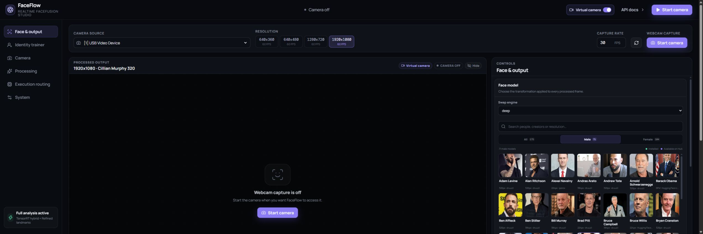
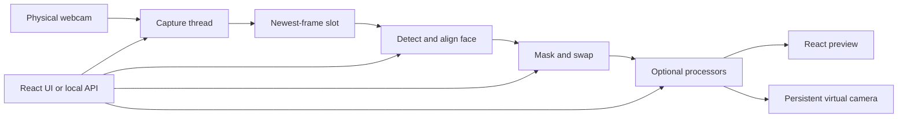
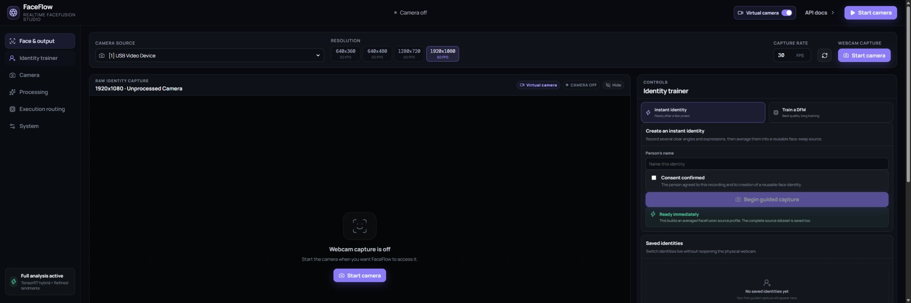
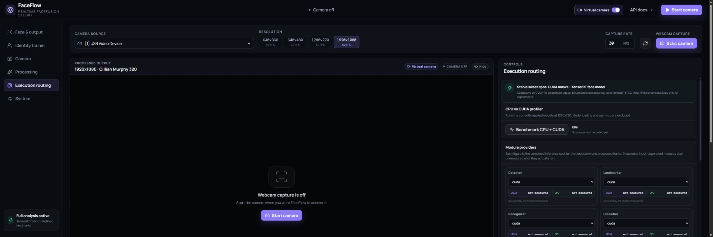

# FaceFlow

FaceFlow is a local, real-time webcam face-processing application built around FaceFusion. It combines a React control surface, FastAPI backend, OpenCV capture, ONNX Runtime inference, TensorRT routing, a persistent virtual camera, tray-demand operation, guided identity capture, and an optional DeepFaceLab DFM training workflow.

The project is developed for Windows and NVIDIA GPUs. The checked-in `facefusion_mrg/` tree makes the repository self-contained; personal captures, models, caches, preferences, training data, and logs stay outside Git.



> The documentation screenshots were captured with physical webcam capture stopped. Preview areas are intentionally blank and contain no webcam footage.

## What it does

- Detects cameras, supported resolutions, and the maximum FPS reported for each mode.
- Switches camera, resolution, and capture rate from the main toolbar without typing dimensions.
- Processes only the newest available frame, dropping stale queued frames when inference is slower than capture.
- Supports DFM deep swapping, classic FaceFusion face swapping, and passthrough.
- Reports processed FPS, processing latency, end-to-end latency, and virtual-camera output rate in real time.
- Routes individual inference modules to CUDA, TensorRT, or CPU and profiles CPU versus GPU timings.
- Keeps non-capture changes live. Changing a face, detector, mask, processor, or execution route does not reopen the physical camera.
- Publishes to a virtual camera for conferencing or recording applications.
- Runs from the Windows tray and can start physical capture only when another application opens the virtual camera.
- Builds reusable instant identities from guided poses and records larger consent-gated datasets for DFM training.
- Exposes the same controls through a local FastAPI API and interactive OpenAPI documentation.

## How the live path works



Capture and inference are decoupled. If the selected camera supplies frames faster than the current pipeline can process them, FaceFlow replaces the pending frame with the latest one instead of building latency. The physical source is reopened only when a capture-source setting changes.

The default NVIDIA routing keeps XSeg masking on CUDA for stable face edges and uses TensorRT FP32 for DFM inference when TensorRT is available. The optional GPU colour pipeline and mask FP16 route are experiments, not universal quality wins; CPU fallback remains available when a GPU operation is unsupported or unhealthy.

## Interface

The camera source, detected resolution presets, per-mode FPS, capture rate, refresh action, and Start/Stop control stay above every tab. The top bar also contains the virtual-camera toggle and API link. The preview can be hidden without stopping processing.

The six control tabs are:

1. **Face & output** - deep/classic/passthrough mode, searchable model gallery, source image upload, morph strength, and realtime behavior.
2. **Identity trainer** - guided instant identities, DFM dataset capture, saved identities, WSL2 DeepFaceLab setup, training jobs, export, and activation.
3. **Camera** - backend, codec, colour handling, recovery, exposure, white balance, and native diagnostic preview.
4. **Processing** - detection, landmarking, selection, masks, enhancers, and optional processors.
5. **Execution routing** - live module timings, a CPU/CUDA comparison at 1280x720, and per-module provider assignment.
6. **System** - primary provider, device, VRAM strategy, startup behavior, stream restart, VRAM release, and API access.

See [features_ui.md](features_ui.md) for the complete control and runtime-behavior map.

### Identity capture



Identity capture shows the raw camera rather than processed output when recording is active. It requires a name and explicit confirmation that the person agreed to the recording and creation of a reusable identity.

- **Instant identity:** at least 6 accepted frames across 3 actions. Completing all 8 actions produces better coverage.
- **DFM dataset:** at least 400 accepted frames across 5 actions; about 2,000 varied frames is recommended. Each action records a 12-second burst at up to 12 clear frames per second.
- **Actions:** straight ahead, turn left, turn right, look up, look down, smile, blink, and speak.

Saved identities can be activated without reopening the webcam, and their complete source datasets can be downloaded deliberately from the UI.

### Execution routing and timings



The routing profiler measures the currently applied models on recorded 1280x720 webcam frames. Warm-up and model-loading time are excluded. It shows whole-pipeline CPU/CUDA time plus per-module figures for detector, landmarker, recognizer, classifier, masker, both swappers, enhancers, colorizer, expression restorer, age modifier, face editor, lip syncer, and content analyser. Disabled or input-dependent modules remain unmeasured until they run.

## Requirements

- Windows 10 or 11
- Python 3.10 or newer
- Node.js and npm for building the React frontend
- A working DirectShow or Media Foundation camera
- An OBS-compatible virtual camera backend for persistent tray advertisement
- NVIDIA GPU recommended for realtime processing
- NVIDIA driver and compatible CUDA runtime for CUDA execution
- TensorRT 10.9 / CUDA 12 packages from `requirements-gpu.txt` for the tested TensorRT path
- WSL2 with Ubuntu 24.04 only if training a DFM locally

The system CUDA compiler can be newer than the runtime used by the Python packages. FaceFlow uses the CUDA/TensorRT libraries installed in its Python environment; `nvcc --version` alone does not prove ONNX Runtime or TensorRT compatibility.

## Installation

```powershell
git clone <repository-url>
cd webcam_facefusion
py -m venv .venv
.venv\Scripts\Activate.ps1
pip install -r requirements-gpu.txt
cd webui
npm install
npm run build
cd ..
```

For a CPU-only environment, install `requirements.txt` instead. CPU mode is useful for compatibility and comparisons, but real-time DFM throughput is expected to be much lower.

Model checkpoints are downloaded or installed into local cache folders as needed and are not committed.

## Run FaceFlow

### Standard desktop mode

Double-click `start_gui.bat`, or run:

```powershell
python web_api.py --port 7862
```

Open [http://127.0.0.1:7862](http://127.0.0.1:7862). The API explorer is at [http://127.0.0.1:7862/docs](http://127.0.0.1:7862/docs).

### Tray mode

Double-click `start_tray.bat`. The tray menu provides:

- Open FaceFlow controls
- Open API options
- Start or stop physical camera capture
- Enable or disable virtual-camera streaming
- Enable or disable start-on-application-demand
- Start demanded sessions with passthrough or the last processing setup
- Exit

Tray mode keeps the virtual camera advertised even when the physical camera is off by publishing a low-cost standby frame. When demand mode is enabled, a supported application opening the OBS virtual-camera queue starts capture. A demand-started session stops eight seconds after the final consumer closes; manual starts keep running until manually stopped.

Stopping capture does not unload the selected pipeline. This makes the next start fast. Use **System -> Free VRAM** when a fully cold idle state is preferred.

### Headless mode

The React app does not have a CLI tab. Headless and scripted operation use `webcam_deep_swap.py` directly:

```powershell
python webcam_deep_swap.py --headless `
  --backend DirectShow --camera 0 --resolution 1920x1080 --fps 30 `
  --ep cuda --device 0 --virtual-cam `
  --swap-mode deep --model iperov/keanu_reeves_320 --morph 100
```

Run `python webcam_deep_swap.py --help` for the current command-line options.

### Legacy Gradio interface

The previous UI remains available as a fallback:

```powershell
start_gradio_gui.bat
```

## First-run workflow

1. Start FaceFlow and leave the webcam stopped while choosing a camera.
2. Refresh camera modes if needed.
3. Pick one of the detected resolution cards. Each card shows the maximum FPS reported for that mode.
4. Set capture FPS at or below that limit.
5. Select the swap engine and model.
6. Choose processing and provider routing. The defaults are the quality/performance baseline.
7. Start the camera and watch the processed FPS and latency cards.
8. Enable the virtual camera only when another application should receive the output.

Staged settings are applied with the bottom action bar. Face, processing, and provider changes apply without reopening the source. Only camera-source keys such as backend, device, resolution, FPS, codec, colour conversion, exposure, and white balance restart capture.

## DFM training

Open **Identity trainer -> Train a DFM**:

1. Record a consented dataset with varied poses and expressions.
2. Use **Open compatible setup** to prepare the maintained RTX 5000/Blackwell DeepFaceLab fork in Ubuntu 24.04 under WSL2. Setup is visible and may request the Linux password.
3. Select the saved dataset and an RTT/pretrained SAEHD workspace containing `data_dst/aligned` and `model`.
4. Prepare the job, extract aligned faces, start or resume training, stop safely at a useful checkpoint, and export the `.dfm`.
5. Select **Use this DFM** to copy it into the custom collection and activate it.

The iteration selector is a progress marker, not an automatic stop. DeepFaceLab saves checkpoints continuously. FaceFlow stops physical capture and releases inference sessions before training so DeepFaceLab can use the GPU; tray mode can continue advertising the standby virtual camera.

## Local API

FastAPI exposes JSON endpoints under `/api` for:

- health and bootstrap metadata
- configuration read/update
- camera discovery and mode detection
- model catalog, thumbnails, installation, and source uploads
- capture and runtime lifecycle
- processed/raw MJPEG and JPEG previews
- live timings and CPU/CUDA benchmarking
- identity sessions, capture, activation, thumbnails, and dataset download
- DFM environment, setup, jobs, extraction, training, stop, export, and activation

Use `/docs` for the current request schemas and interactive calls rather than relying on a copied endpoint list.

## Privacy and repository safety

Camera frames and identity data are processed locally. `.assets/`, `.caches/`, preferences, logs, benchmarks, generated frontend output, captured media, and DFM jobs are ignored by Git. Do not force-add them.

Before publishing, inspect the exact staged file list and scan it for emails, absolute home paths, credentials, logs, and captured media. See [PRIVACY.md](PRIVACY.md) for the complete checklist.

Use FaceFlow only with the informed consent of every person whose likeness is recorded, transformed, trained, or distributed.

## Troubleshooting

- **Camera is busy:** close other applications using the physical webcam, then try the other Windows backend.
- **Requested resolution falls back:** use detected modes, try MJPG, and verify the selected FPS does not exceed the mode limit.
- **Black frames:** keep automatic repair enabled and increase black-frame retries.
- **Face detection flickers:** keep temporal face tracking off, lower the detection threshold carefully, increase detector size, or improve lighting.
- **Mask-edge artifacts:** keep XSeg on CUDA and avoid experimental mask FP16; verify occlusion and temporal-mask settings.
- **DFM starts slowly:** the first TensorRT engine build is expensive; later runs reuse the disk cache.
- **Virtual camera is missing:** install/configure the OBS virtual camera backend and restart the consuming application.
- **GPU memory should be released:** stop capture, then use **System -> Free VRAM**.

## Main components

| Path | Purpose |
|---|---|
| `web_api.py` | FastAPI server, configuration, lifecycle, identity/DFM API, frontend host |
| `webui/` | React and TypeScript control surface |
| `webcam_deep_swap.py` | capture, inference, latest-frame scheduling, virtual camera, legacy UI, headless mode |
| `tray_app.py` | Windows tray host and camera-demand monitor |
| `facefusion_mrg/` | vendored FaceFusion runtime and processing modules |
| `features_ui.md` | detailed UI, default, preference, and restart reference |
| `PRIVACY.md` | local-data and public-release safety checklist |

This is an experimental local project, not a guarantee of production-grade identity, safety, quality, or latency. Test each model and route visually on your own camera and lighting before relying on the virtual output.
